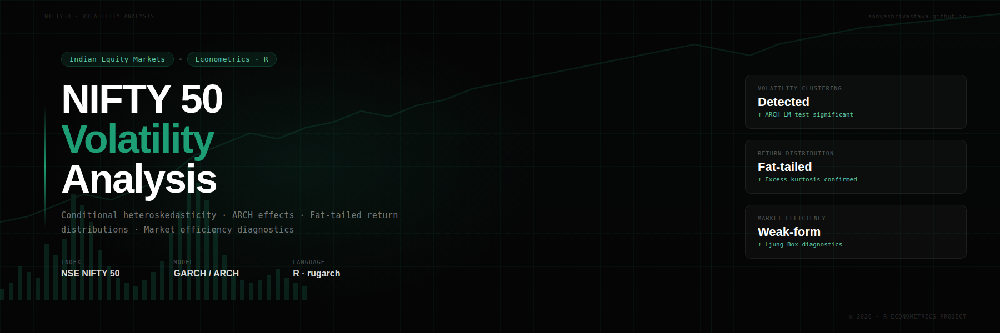

# Quantitative Volatility Research: NIFTY 50 (ARCH/GARCH Framework)



Econometric investigation of market volatility, fat tails, and conditional variance dynamics using real Indian equity data.

## Overview

This project analyzes the statistical properties and volatility dynamics of NIFTY 50 daily log returns from 2007–2025 using econometric and time-series methods in R.

The study examines whether NIFTY 50 returns exhibit:
- weak-form market efficiency
- volatility clustering
- fat-tailed behavior
- conditional heteroscedasticity
- asymmetric volatility effects

The analysis was conducted using R and published as an interactive HTML report via GitHub Pages.

---

## Key Findings

- Daily returns exhibit near-zero linear predictability
- Return distributions display strong excess kurtosis and fat tails
- Significant ARCH effects confirm volatility clustering
- Squared returns exhibit persistent autocorrelation
- Evidence consistent with the leverage effect was observed
- Gaussian VaR models underestimate downside risk

---

## Methods Used

- Log return transformation
- Descriptive statistics
- Jarque–Bera normality test
- Augmented Dickey–Fuller stationarity test
- ACF and PACF analysis
- Ljung–Box diagnostics
- ARCH LM test
- Rolling volatility analysis
- Value-at-Risk comparison

---

## Tools and Libraries

- R
- R Markdown
- quantmod
- tseries
- FinTS
- zoo
- knitr
---
## Research Questions

1. Does the NIFTY 50 exhibit volatility clustering?
2. Are returns normally distributed or fat-tailed?
3. Which model performs better: ARCH or constant variance?
---

## Live Report

[View Full HTML Report](https://aanyashrivastava.github.io/NIFTY50-Volatility-Analysis/)

---
## Answers Summary

- Strong volatility clustering is present  
- Returns are fat-tailed (non-Gaussian)  
- ARCH-family models significantly outperform constant variance models
---

##  Why This Matters

Volatility modelling is central to:
- Option pricing (Black-Scholes extensions)
- Risk management (VaR models)
- Algorithmic trading strategies
- Portfolio hedging
  
## Repository Structure

```text
docs/
├── index.html
└── style.css

nifty50_analysis.Rmd
README.md
```

---

## Author

Aanya Shrivastava
